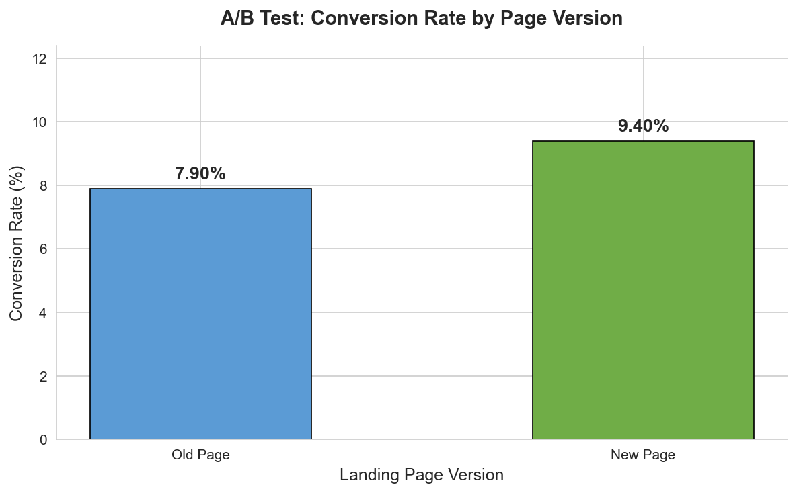

# Marketing A/B Test: Landing Page Conversion Analysis

## Business Question

> **Did the new landing page increase conversion rates compared to the old page?**

## Tools Used

- **Python 3.10+**
- **pandas** — data manipulation
- **numpy** — numerical operations
- **matplotlib & seaborn** — data visualization
- **statsmodels** — statistical hypothesis testing
- **Jupyter Notebook** — interactive analysis

## Dataset Description

| Column | Description |
|--------|-------------|
| `user_id` | Unique identifier for each visitor |
| `page_version` | `old` or `new` landing page variant |
| `visited` | Whether the user visited the page (always 1) |
| `converted` | Whether the user completed the desired action (0 or 1) |

- **2,000 users** split evenly (1,000 per group)
- Simulated conversion rates: ~8% (old) vs ~9.5% (new)
- Random seed set for full reproducibility

## Analysis Steps

1. **Generate mock dataset** — create realistic A/B test data
2. **Data quality checks** — verify shape, missing values, group balance, valid values
3. **Summary statistics** — visitors, conversions, and conversion rates by group
4. **Lift calculations** — absolute lift and relative lift
5. **Hypothesis test** — one-sided two-proportion z-test (H₁: new > old)
6. **Visualization** — clean bar chart comparing conversion rates
7. **Business recommendation** — plain-English conclusion

## Data Quality Checks

- No missing values
- Equal group sizes (1,000 per variant)
- All `converted` values are 0 or 1
- All `visited` values are 1

## Key Metrics

| Metric | Value |
|--------|-------|
| Old page conversion rate | ~8.0% |
| New page conversion rate | ~9.5% |
| Absolute lift | ~1.5 pp |
| Relative lift | ~18.8% |
| Statistical test | Two-proportion z-test (one-sided) |

## Chart

The final visualization is saved to `outputs/conversion_rate_chart.png`:



## Business Recommendation

The new landing page should **not** be rolled out yet. The observed improvement is **not statistically significant**, so we cannot confidently conclude the new page performs better.

## Next Steps

1. **Continue the A/B test with a larger sample size**  
   - Current: 2,000 users (1,000 per group)  
   - Recommended: 4,000–5,000 users total

2. **OR iterate on design**  
   - Test alternative variations that may produce a larger effect

3. **Monitor current performance**  
   - Keep the old page as default while gathering more data

## How to Run

```bash
# 1. Create virtual environment
python -m venv .venv

# 2. Activate it
# macOS/Linux:
source .venv/bin/activate
# Windows:
.venv\Scripts\activate

# 3. Install dependencies
pip install -r requirements.txt

# 4. Launch Jupyter
jupyter notebook notebooks/ab_test_analysis.ipynb
